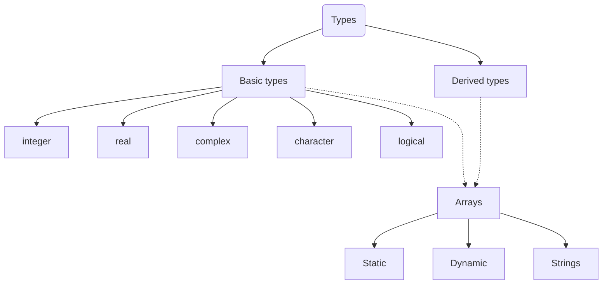

# FORTRAN

- [FORTRAN](#fortran)
  - [Hello world!](#hello-world)
  - [Variables and types](#variables-and-types)
    - [Simple types](#simple-types)
    - [Constants](#constants)
    - [Derived types](#derived-types)
    - [Arrays](#arrays)
    - [Strings](#strings)
    - [General view](#general-view)
  - [Operators](#operators)
    - [Logical and relation operators](#logical-and-relation-operators)
  - [Code structure](#code-structure)
    - [Subroutines \& functions](#subroutines--functions)
    - [Modules](#modules)
  - [Flow control](#flow-control)


## Hello world!

This is the basic unit, the compiler will translate the code inside the program as the main method in C++.

```fortran
program hello
	! This is a comment line; it is ignored by the compiler
  	print *, 'Hello, World!'
end program hello
```

## Variables and types

FORTRAN is static and strongly typed language.

### Simple types

```fortran
program variables
    !This line disable the implicit typing (bad practice)
    implicit none 
    ! Variable declaration: Separate the inicialitzation, 
    ! otherwise it imples a save attribute
    integer :: amount
    real :: pi
    complex :: frequency
    character :: initial
    logical :: isOkay

	! Init and assign via = operator
	pi = 3.1415927
end program variables
```

### Constants

To define a constant, use the `parameter` attribute in the declaration of the variable

### Derived types

As C/C++ structs. The basic usage is:

```fortran
! Define
type :: t_pair
  integer :: i [= def_value]
  real :: x [= def_value]
end type
! Declare
type(t_pair) :: par_var
! Several init forms:
par_var%i = 1
par_var%x = 0.4

par_var = t_pair(1, 0.5)      ! Initialize with positional arguments
par_var = t_pair(i=1, x=0.5)  ! Initialize with keyword arguments
par_var = t_pair(x=0.5, i=1)  ! Keyword arguments can go in any order
```

* We can add a default initialisation value and call with an empty type constructor.
* `bind(c)` offers interoperability with C programming language

### Arrays

```fortran
! Declaration
integer, dimension(10) :: array1
integer :: array2(10)
! 2D real array
real, dimension(10, 10) :: array3
! Custom lower and upper index bounds, by default index start at 1
real :: array4(0:9)

! Initialization
array1 = [1, 2, 3, 4, 5, 6, 7, 8, 9, 10]  ! Array constructor
array1 = [(i, i = 1, 10)]  ! Implied do loop constructor
array1(:) = 0  	! Set all elements to zero
array1(1:5) = 1 ! Set first five elements to one
array1(6:) = 1  ! Set all elements after five to one
```

> **Arrays slicing** with the subscript operator `()` we can use the wildcard `:` like the initialisation example.

The **allocatable** array attribute is used when we need a dynamic structure, the usage is:

```fortran
integer, allocatable :: array1(:)
integer, allocatable :: array2(:,:)

allocate(array1(10))
allocate(array2(10,10))

! Do stuff

deallocate(array1)
deallocate(array2)
```

> Allocatable local arrays are deallocated automatically when they go out of scope.

### Strings

Special case of array, they can be static or dynamic.

```fortran
character(len=4) :: first_name
character(:), allocatable :: last_name
character(:), allocatable :: full_name

first_name = 'John'
! Allocation on assignment
last_name = 'Smith'

! String concatenation (// operator) & allocation on assignment
full_name = first_name//' '//last_name
```

 [Useful string methods](https://www.tutorialspoint.com/fortran/fortran_characters.htm)

### General view



## Operators

### Logical and relation operators

| Operator | Alternative |
| :------: | :---------: |
|   `==`   |   `.eq.`    |
|   `/=`   |   `.ne.`    |
|   `>`    |   `.gt.`    |
|   `<`    |   `.lt.`    |
|   `>=`   |   `.ge.`    |
|   `<=`   |   `.le.`    |

| Operator | Description                                                  |
| :------: | :----------------------------------------------------------- |
| `.and.`  | TRUE if both left and right operands are TRUE                |
|  `.or.`  | TRUE if either left or right or both operands are TRUE       |
| `.not.`  | TRUE if right operand is FALSE                               |
| `.eqv.`  | TRUE if left operand has same logical value as right operand |
| `.neqv.` | TRUE if left operand has the opposite logical value as right operand |

| Math Operator | Description    |
| :-----------: | -------------- |
|     `**`      | Exponent       |
|      `*`      | Multiplication |
|      `/`      | Division       |
|      `+`      | Addition       |
|      `-`      | Subtraction    |

## Code structure

### Subroutines & functions

* **Subroutines** Invoked via call. 
* **Functions** Invoked within an expression or assignment for the return value.
* Use **subroutines** if the your procedure needs to modify ther arguments otherwiese use **functions**.

* **The order of the declaration at the source code for the subroutine or functions it doesn't affect the compilation.**

```fortran
! Print matrix A to screen
subroutine print_matrix(n,m,A)
    implicit none
    integer, intent(in) :: n
    integer, intent(in) :: m
    real, intent(in) :: A(n, m)

    integer :: i

    do i = 1, n
    	print *, A(i, 1:m)
    end do
end subroutine print_matrix

! L2 Norm of a vector
function vector_norm(n,vec) result(norm)
    implicit none
    integer, intent(in) :: n
    real, intent(in) :: vec(n)
    real :: norm

    norm = sqrt(sum(vec**2))

end function vector_norm

program main
  ! ...
	print *, 'Vector norm = ', vector_norm(9,v)
  	call print_matrix(10, 20, mat) 
end program main
```

In the two cases, the arguments are specified in the body of the subroutine/function with the attribute intent:

```fortran
subroutine or function my_subroutine_or_method(n,m,p)
  implicit none
  integer, intent(in) :: n
  integer, intent(inout) :: m
  real, intent(out) :: p
  
  ! Here starts the body of the subroutine|method
  
end subroutine or function print_matrix
```

> Then, as good practice is usefull to always have pure functions (no use of intent(inout) or intent(out)). If is required to modify, use subroutines.

### Modules

* A **module** can be defined as collection of methods and subroutines. 

* The module are used inside programs and other modules, via ``use`` keyword and it can be:
  * Simply import with ``use my mod``
  * Import only a list of methods, vars with  `` use my_mod, only: public_var`` 
  * Import with an alias ``use my_mod, only: printMat=>print_matrix``

```fortran
module my_mod
    implicit none
	!<use statements>  
	!! Access properties (private, public). Can be specified for each var/method.
    private  
    public public_var, print_matrix  ! Explicitly export public entities
    
    !<declarations>
    real, parameter :: public_var = 2
    integer :: private_var

contains

    ! Print matrix A to screen
    subroutine print_matrix(A)
		! ...
    end subroutine print_matrix

end module my_mod
```

## Flow control

```fortran
!Conditionals syntax it can be nested.
if (logical exp) then
	! ...
else if (logical exp) then
	! ...
else
end if
!Case switch, where selector can be any value or a range (using :)
select case (expression) 
   case (selector1)          
   ! some statements          
   ... case (selector2)           
   ! other statements           
   ...       
   case default          
   ! more statements          
   ...   
end select
```

```fortran
!Loops, var goes in the range [start, stop]. Loops can be nested.
do var = start, stop [,step]
   !statement(s)
   !...
end do

do while(logical exp)

end do
```

The control statements related are:

* `exit`  As C break. The execution goes out of the loop.
* `cycle` As C continue. The execution goes to the nest iteration.
* `stop` As C exit. The program stops.
